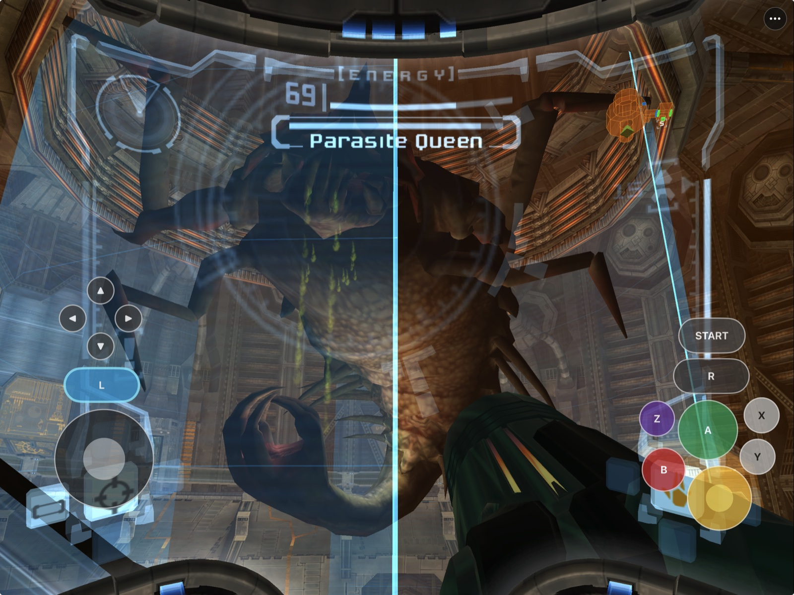
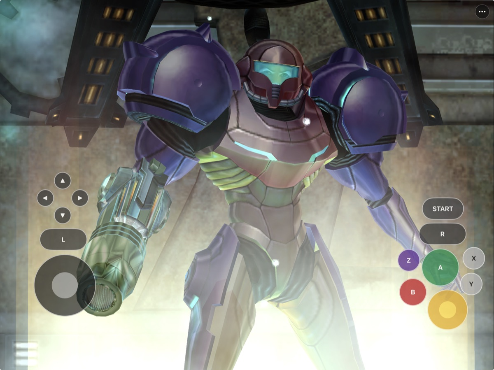
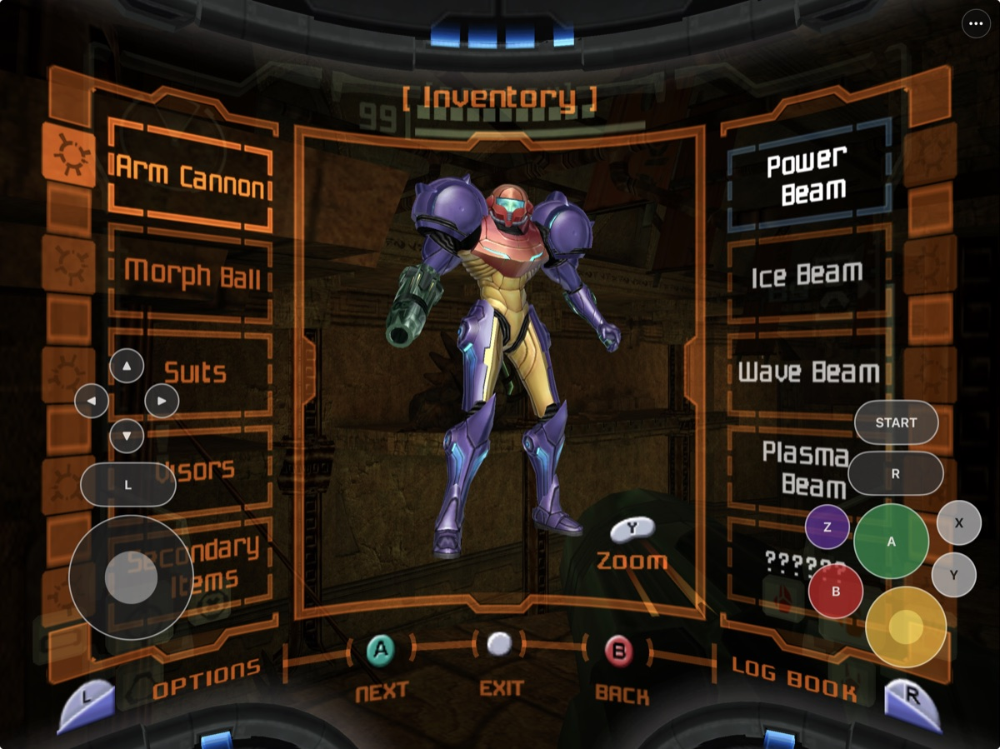
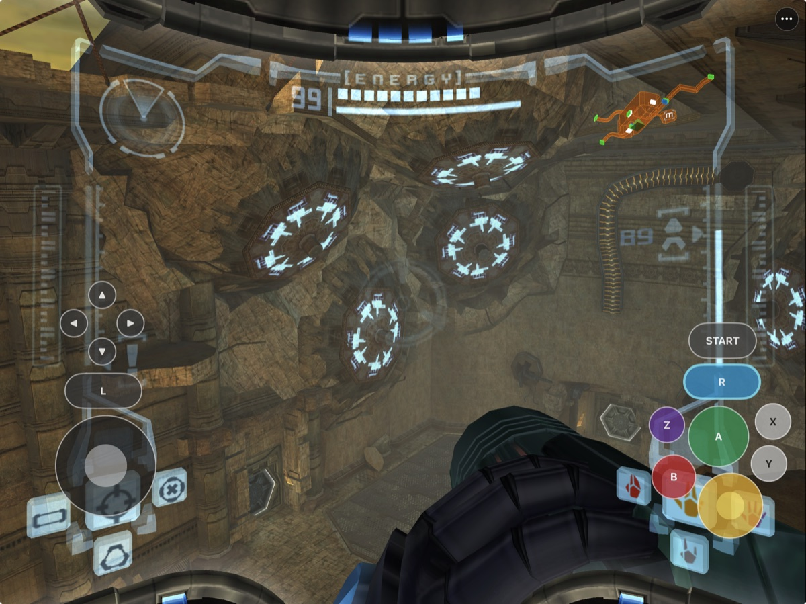
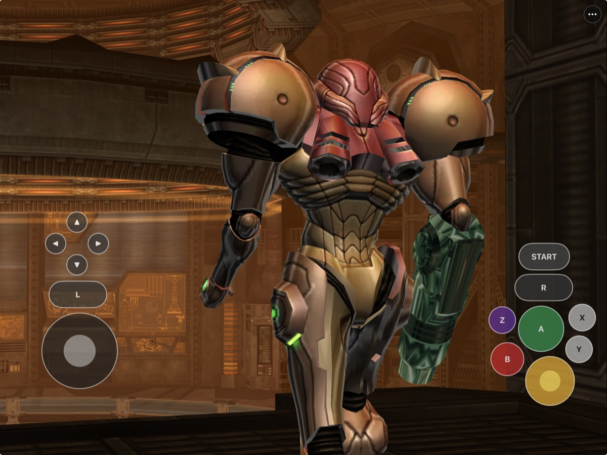
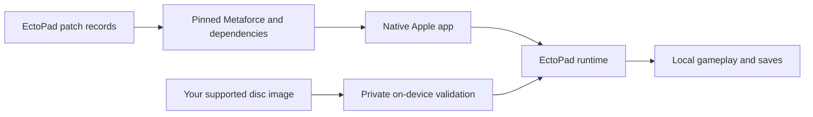

# EctoPad

<p align="center">
  
</p>

<p align="center">
  <em>The Parasite Queen encounter running on a physical iPad.</em>
</p>

<p align="center">
  <strong>Metroid Prime through Metaforce, with a complete Apple mobile layer.</strong><br>
  Touch controls, on-device setup, native settings, diagnostics, save-safe
  updates, and targeted device fixes for iPhone, iPad, and Apple Silicon Mac.
</p>

<p align="center">
  
  
  
  
  
  
</p>

EctoPad is a downstream Apple integration of
[Metaforce](https://github.com/AxioDL/metaforce), the native Metroid Prime
engine originally authored by Jack Andersen and Phillip "Antidote" Stephens
and developed by its contributors.

Metaforce and [Aurora](https://github.com/encounter/aurora) provide the engine,
game systems, Metal rendering path, controller foundation, and original
iOS/tvOS platform support. EctoPad builds on that work with the mobile
interface, on-device workflows, and Apple-specific fixes recorded in this
repository.

## What EctoPad adds

At the pinned public upstream revisions used by this project, the iOS build
expected `game.iso` to be placed manually in app storage and did not include
EctoPad's mobile layer:

- SunPad-derived on-screen controls, layout editing, and touch settings;
- Files-based game-data import, validation, and private activation;
- native display, controller, save, and diagnostic interfaces;
- automatic iOS memory-card provisioning and save-preserving updates;
- lifecycle, secondary-scene, resume, and controller-reconnect fixes; and
- reproducible packaging, diagnostics, and physical-device validation.

EctoPad was created because the existing iOS target did not provide this
complete, touch-ready experience in the public revision tested. If that
experience had already existed, there would have been no reason to build
EctoPad.

## Project scope

Metaforce remains the engine, and Aurora remains the rendering and platform
foundation. EctoPad does not claim authorship of either project or of the
original iOS target. Its scope is the downstream mobile integration,
device-specific fixes, and validation documented here.

EctoPad has sustained native gameplay on the physical iPhone and iPad devices
recorded in this repository. That is the basis for describing the tested build
as stable. It does not mean bug-free operation, full-game validation, or
universal stability across every device. The remaining visual, audio,
lifecycle, and gameplay defects are documented below.

This is **not** a Dolphin or RetroArch frontend, an official Nintendo product,
or a general GameCube emulator. It requires a user-supplied, legally obtained
**Metroid Prime (USA, Rev 2)** disc image. No game, disc image, extracted asset,
save, key, or signing material is included in this repository.

## EctoPad in action

<table>
  <tr>
    <td width="50%" valign="top">
      
      <br><sub><strong>Original presentation.</strong> Metaforce carries Prime's cinematics, animation, and game flow into the native runtime.</sub>
    </td>
    <td width="50%" valign="top">
      
      <br><sub><strong>Complete game systems.</strong> Inventory, beams, suits, Morph Ball upgrades, options, and the logbook remain part of the original interface.</sub>
    </td>
  </tr>
  <tr>
    <td width="50%" valign="top">
      
      <br><sub><strong>Exploration on iPad.</strong> Adjustable touch controls sit over the visor while native render scaling presents larger environments cleanly.</sub>
    </td>
    <td width="50%" valign="top">
      
      <br><sub><strong>Built on upstream rendering.</strong> Metaforce and Aurora render through Metal; EctoPad adds the iPhone/iPad interface and device workflow.</sub>
    </td>
  </tr>
</table>

## Project status

| Option | Status | Details |
|---|---|---|
| Physical iPhone/iPad development build | **Playable release baseline with known visual defects** | EctoPad 0.1.3 builds, signs, installs in place, reaches gameplay, and preserves existing game data, saves, and settings. The first-door and black-geometry defects below are confirmed on both device classes. |
| HDMI external display | **Working** | Physical HDMI output has been tested successfully with the current iPad build. |
| Local iPhone/iPad build | **Developer workflow available** | The current checkout needs pinned upstream repositories plus the maintained patch sequence. A clean one-command public bootstrap is still planned. |
| iOS Simulator | **Engineering path available** | Useful for build, UI, import, and regression work; it does not replace physical-device audio, controller, thermal, or accessory testing. |
| Apple Silicon macOS | **Playable development build** | The native `EctoPad.app` launches directly into the complete EctoPad/Metaforce runtime. Metal rendering, audio, existing memory-card loading, mouse/keyboard gameplay, visor switching, menus, and clean shutdown were accepted in a 59% Chozo Ruins save on 2026-08-17. |
| Public IPA | **Not available** | The previously tracked unsigned validation IPA was removed while dependency licensing, corresponding-source, and relink requirements are resolved. Source builds remain available. |
| TestFlight / App Store | **Not available** | No Apple-hosted distribution or App Store review has been completed. |

The current 0.1.3 source/device build is the selected packaging baseline. It is
substantially playable, including the opening Frigate sections, native settings
menu, render scaling, aspect-ratio selection, FPS counter, touch movement, and
basic controller gameplay. That release decision does not mean the confirmed
visual defects below are fixed or physically accepted.

### Known limitations

- **P0 — selective black world geometry:** on both physical iPhone and iPad,
  individual walls, beams, debris, and large silhouettes can render completely
  or nearly black while the HUD, arm cannon, lights, screens, and door shields
  remain visible. The iPhone report also describes distance-dependent
  focus/sharpness changes. Logs show no Dawn/Metal failure and do not yet record
  the failing draw, material, texture/sampler, mip/LOD, or pipeline identity.
- **P0 — first tutorial door:** shooting it plays the sound and removes
  collision, so Samus can walk through, but the panels remain visibly closed.
  iPhone and iPad traces show the authored animation and CPU pose completing;
  ordinary doors using the same assets open normally. This is a special
  presentation-path defect, not a generic door-state failure.
- A brief audio aberration can occur during the frontend-to-opening-cinematic
  transition. Extended audio-route and interruption testing remains open.
- An earlier session ended near a Morph Ball transition and has not reproduced
  consistently. Later-area and long-session stability still need broader play.
- A complete physical-iPad save-station save, terminate, relaunch, and load
  acceptance cycle remains to be recorded.
- The private Files importer is implemented and Simulator-tested, but selecting
  and importing a fresh disc image through Files still needs physical-device
  acceptance.

The prioritized defect list and dated evidence live in
[`docs/TECH-DEBT.md`](docs/TECH-DEBT.md),
[`docs/KNOWN_ISSUES.md`](docs/KNOWN_ISSUES.md), and
[`docs/TESTING.md`](docs/TESTING.md).

### Reporting a useful visual defect

Open `••• → Share Diagnostic Log` immediately after the problem and share the
resulting EctoPad diagnostic file. Include the Apple device and OS version,
approximate time, room, render scale/aspect mode, whether the app recently
resumed from the background, and a screenshot or short video showing the exact
surface. For focus/sharpness changes, hold the camera direction fixed and record
a slow approach to the surface. Never attach the disc image, memory-card files,
saves, or signing material.

## What is included

| Area | Current implementation |
|---|---|
| Rendering | Metaforce → Aurora GX compatibility layer → Dawn/WebGPU → Metal |
| Mobile interface | SunPad-derived native UIKit overlay and `•••` settings menu |
| Display settings | Native, 2×, 3×, and 4× render scales; original, widescreen, and surface-fill aspect modes; optional FPS counter |
| Input | Touch controls, SDL game controllers, and desktop keyboard/mouse support |
| Saves | Automatically provisioned Slot A and Slot B GameCube memory-card images |
| Game data | Files-based import with exact revision validation, private staging, and atomic activation |
| Diagnostics | Persistent rotating runtime log plus an in-app **Share Diagnostic Log** action |
| Audio | Metaforce/amuse game audio through SDL3 and the Apple audio session |

## Supported game

| Game | Revision | Status |
|---|---|---|
| **Metroid Prime** | USA / NTSC-U, Rev 2 (`GM8E01`) | Supported target |
| Other regions or revisions | Any other disc ID or revision | Not currently supported |
| Other GameCube games | Any | Not supported; EctoPad is not a general emulator |

The supported raw ISO/GCM is 1,459,978,240 bytes and has SHA-1
`1a737910b55b59c6ad91be9e3e3c43517fd52efb`. See
[`docs/GAME_DATA.md`](docs/GAME_DATA.md) for the complete validation record and
accepted data flow. EctoPad never downloads game data.

## Getting started

You currently need:

- an Apple Silicon Mac with Xcode and its command-line tools;
- CMake 3.25 or newer, Ninja, Python 3, Rust with the required Apple targets,
  and SDL3;
- an Apple ID configured in Xcode only for physical iPhone/iPad signing;
- the pinned upstream source trees and EctoPad patch sequence described in
  [`docs/DEPENDENCIES.md`](docs/DEPENDENCIES.md); and
- your own legally acquired supported Metroid Prime disc image.

### macOS (Apple Silicon)

With the pinned `ref/` workspace and EctoPad patches already present, build and
verify the native Mac app with:

```sh
./scripts/build-macos.sh
```

That produces `EctoPad.app` with the same original EctoPad icon used on iPhone
and iPad, builds the controller regression target, and runs its five
slot/reconnect checks. Launch it against your own verified
Metroid Prime USA Rev 2 disc image with:

```sh
./scripts/run-macos.sh /path/to/your/game.iso
```

The launcher verifies the image locally before starting the app. Standard SDL3
game controllers use the original GameCube input model and can be connected
before or after launch. The Mac build is currently a source-built development
app, not a notarized downloadable release. Physical Mac controller coverage is
still narrower than the software path: reconnect handling is regression-tested,
but individual controller models and rumble are not broadly certified.

When no controller is connected, the Mac defaults are:

| Input | Action |
|---|---|
| W / S | Move forward / backward |
| A / D | Strafe left / right |
| Mouse | Turn; look up/down while right click is held |
| Left click | Fire beam / drop bomb |
| Right click (hold) | Free-look / aim; Spider Ball where available |
| Shift (hold) | Lock on / target; scan and grapple context |
| F | Missile / Power Bomb |
| Space | Jump / Boost Ball |
| C | Morph Ball |
| Q / E | Combat Visor / Scan Visor |
| Z / X | Thermal Visor / X-Ray Visor |
| 1 / 2 / 3 / 4 | Power / Wave / Ice / Plasma Beam |
| Tab | Map |
| Arrow keys | Frontend, pause-menu, and map navigation |
| Enter | Start / pause / confirm frontend |
| Escape | Release mouse capture; press again for pause/back |

Right click retains Prime's distinct free-look/aim state: moving vertically
while it is held raises Samus's arm and keeps the selected pitch steady.
Releasing it exits aim and restores Prime's normal recenter behavior. Shift
retains lock-on/targeting, and right click also keeps the contextual Spider
Ball action. The four visor keys
mirror the visor selector shown in the HUD, while the number row handles the
four beam types. Connecting a controller gives the SDL gamepad path player-one
input instead of mixing two active devices together; disconnecting it restores
mouse and keyboard input.

### iPhone and iPad

The high-level device build is:

```sh
./scripts/sync-app-icon.sh
cd ref/metaforce
cmake --preset ios-default
cmake --build --preset ios-default --target metaforce -j8
```

The app is written to:

```text
ref/metaforce/build/ios-default/Binaries/Metaforce.app
```

Sign that source app with your own Apple Development identity, verify it with
`codesign --verify --deep --strict`, and install it in place with
`xcrun devicectl`. Never uninstall an existing copy merely to update it: doing
so can destroy locally imported game data and saves.

The repository does not yet recreate the ignored `ref/` workspace from a fresh
clone automatically. Follow [`docs/BUILDING.md`](docs/BUILDING.md) for the exact
current build, signing, Simulator, and save-preserving device procedure. The
tracked unsigned-package script is for local validation only; see
[`docs/INSTALL_IPA.md`](docs/INSTALL_IPA.md) before using it.

## First launch and game data

EctoPad keeps the disc image, saves, settings, and diagnostics inside its
private app container.

1. Build, sign, install, and launch EctoPad.
2. Open the persistent `•••` menu.
3. Choose **Game Data & Saves**.
4. Select your legally obtained Metroid Prime USA Rev 2 ISO/GCM through Files,
   or place it in EctoPad's Files-visible folder and choose the folder import.
5. Leave EctoPad open while it validates and privately activates the image.
6. Press the on-screen **START** button or Start on a connected controller.

Import uses a same-directory staging file, validates the expected game ID and
SHA-1, and atomically replaces only the active `game.iso`. Removing or
reimporting game data does not intentionally remove memory cards, settings, or
logs.

## Controls

EctoPad provides a landscape touch layout designed around the original
GameCube controls:

- **Left stick:** move Samus.
- **D-pad:** select visors.
- **C-stick:** select beams, matching the original game; it is not a modern
  free-look stick.
- **A / B / X / Y / Z:** beam fire, jump, Morph Ball, missiles, and map/game
  actions according to the original Prime mapping.
- **L:** lock on. **R:** free-look/aim behavior used by the original game.
- **L/R touch latch:** hold either shoulder for 0.5 seconds to latch it; tap it
  again to release. The control changes color and provides haptic feedback.
- **START:** pause or advance the frontend.
- **`•••`:** open display, controller, touch, game-data, save, and diagnostic
  settings without leaving the game.

Touch opacity, overall size, individual control size and position, and
hide-on-controller behavior are adjustable. Controller button remapping is
available from the native menu. Basic gameplay with a physical controller has
been exercised on Apple mobile hardware. The macOS SDL gamepad path and
reconnect policy have deterministic coverage, but physical Mac controller
models, rumble, and a wider controller matrix remain acceptance work.

On macOS, EctoPad adds a desktop-native layer without changing the touch or
controller defaults used on iPhone and iPad. WASD provides movement, the mouse
turns the camera, right click holds free-look for vertical aiming, Shift holds
lock-on, and Q/E/Z/X select
Combat/Scan/Thermal/X-Ray visors. See the complete table under
[macOS (Apple Silicon)](#macos-apple-silicon).

## Reproducible and game-data-free



`ref/`, build outputs, disc images, extracted material, saves, logs, and signing
assets are ignored. [`scripts/audit-ios-package.sh`](scripts/audit-ios-package.sh)
rejects game data, private artifacts, credentials, and signing material from the
local unsigned validation package. Passing that audit proves package hygiene,
not permission to distribute the binary. Generated IPAs and checksums remain
ignored until the release gates in
[`docs/RELEASE_COMPLIANCE.md`](docs/RELEASE_COMPLIANCE.md) are complete.

## Frequently asked questions

<details>
<summary><strong>Where can I download the IPA?</strong></summary>

There is no public IPA right now. The previous unsigned validation package was
removed because the repository had not yet assembled the exact corresponding
source and LGPL relink materials required for a binary release. The licensing
status of the pinned
[zeus](https://github.com/AxioDL/zeus) and
[kabufuda](https://github.com/AxioDL/kabufuda) trees also needs authoritative
clarification or clearly licensed replacements.

Help is welcome through an [EctoPad issue](https://github.com/chrissotraidis/ectopad/issues)
or pull request. Useful contributions include source-backed license evidence,
licensed replacement dependencies, a replacement for the statically linked
[soxr](https://github.com/chirlu/soxr) path, and reproducible source/relink
packaging. Please do not contact or pressure upstream maintainers on EctoPad's
behalf.
</details>

<details>
<summary><strong>What is EctoPad, and what is Metaforce?</strong></summary>

[Metaforce](https://github.com/AxioDL/metaforce) is the upstream native Metroid
Prime engine. It provides the game systems and, through Aurora, the underlying
rendering and platform foundation.

EctoPad is a downstream Apple integration built on Metaforce. It applies a
documented patch set and adds the iPhone/iPad interface, touch controls,
on-device setup, native settings, diagnostics, save-safe installation workflow,
and Apple-specific lifecycle and external-display fixes. EctoPad does not claim
authorship of Metaforce, Aurora, or their original iOS support.
</details>

<details>
<summary><strong>Does this repository contain Metroid Prime?</strong></summary>

No. You must supply your own legally acquired supported disc image. Do not open
issues requesting game data, keys, extracted assets, or download links.
</details>

<details>
<summary><strong>Is this emulation?</strong></summary>

EctoPad runs Metaforce, a native reimplementation of the Metroid Prime engine.
The game-facing GX API is translated by Aurora through WebGPU/Dawn to Metal,
but EctoPad does not emulate a complete GameCube console or run arbitrary
GameCube software.
</details>

<details>
<summary><strong>Does it support controllers?</strong></summary>

Yes. SDL3 gamepad input feeds the original GameCube input model on macOS and
iOS/iPadOS, and a physical controller has been used for mobile gameplay. Five
deterministic tests cover the current controller slot/reconnect policy.
Physical Mac controller models, rumble, and broader reconnect testing remain
open before controller support is called comprehensive.
</details>

<details>
<summary><strong>Where should I report a bug?</strong></summary>

Report EctoPad's Apple integration issues here, including touch controls,
on-device import, native settings, lifecycle, external displays, installation,
and diagnostics.

EctoPad still runs the upstream Metaforce engine, Aurora renderer, and their
dependencies. A rendering, audio, gameplay, or engine crash seen in EctoPad is
not automatically an EctoPad-specific defect. File the report here first if you
encountered it in EctoPad. We will triage it against the pinned upstream code;
if it reproduces in unmodified Metaforce or the evidence places it upstream,
the report will be linked or redirected to the appropriate project.

Include the approximate time and room, Apple device/OS, render settings, the
action immediately before the problem, whether touch or a controller was
active, and a screenshot or short video for visual defects. Use `••• → Share
Diagnostic Log` immediately afterward. Never attach the disc image, memory
cards, saves, or signing material.
</details>

## Project map

| Path | Purpose |
|---|---|
| [`patches/`](patches/) | Ordered EctoPad changes and rejected-experiment records for the pinned upstream trees |
| [`scripts/package-ios.sh`](scripts/package-ios.sh) | Deterministic unsigned local validation package |
| [`scripts/audit-ios-package.sh`](scripts/audit-ios-package.sh) | Game-data, signing-material, and package-hygiene audit |
| [`assets/app-icon/`](assets/app-icon/) | Original EctoPad icon master, Apple-size derivatives, and provenance |
| [`scripts/sync-app-icon.sh`](scripts/sync-app-icon.sh) | Sync the tracked EctoPad icon into the ignored Metaforce build tree |
| [`scripts/build-macos.sh`](scripts/build-macos.sh) | Build and verify the native arm64 `EctoPad.app`, its icon, and controller regression target |
| [`scripts/run-macos.sh`](scripts/run-macos.sh) | Validate a private supported disc image and launch EctoPad fullscreen |
| [`docs/BUILDING.md`](docs/BUILDING.md) | Complete build, signing, Simulator, and installation procedure |
| [`docs/GAME_DATA.md`](docs/GAME_DATA.md) | Supported revision, hashes, and private import design |
| [`docs/TECH-DEBT.md`](docs/TECH-DEBT.md) | Current physical iPhone/iPad defect queue |
| [`docs/TESTING.md`](docs/TESTING.md) | Evidence ledger and remaining acceptance checks |
| [`docs/ARCHITECTURE.md`](docs/ARCHITECTURE.md) | Metaforce, Aurora, Dawn, Metal, input, audio, and storage architecture |
| [`docs/RELEASE_COMPLIANCE.md`](docs/RELEASE_COMPLIANCE.md) | Public-binary blockers and the exact republication gate |
| [`docs/LEGAL_AND_PROVENANCE.md`](docs/LEGAL_AND_PROVENANCE.md) | Redistribution and provenance boundary |
| [`THIRD_PARTY_NOTICES.md`](THIRD_PARTY_NOTICES.md) | Dependency licenses and notices |
| [`artifacts/README.md`](artifacts/README.md) | Why no public IPA is currently tracked |
| [`scripts/check-release-boundary.sh`](scripts/check-release-boundary.sh) | Reject accidentally tracked IPAs, checksums, or README download links |
| `ref/` | Ignored local source/game-data workspace; never published by this repository |

## Contributing and support

Use [GitHub Issues](https://github.com/chrissotraidis/ectopad/issues) for a
reproducible platform or gameplay defect. Include the EctoPad version, Apple
device and OS version, input method, display route, reproduction steps, and a
redacted diagnostic log when possible. Never upload copyrighted game material
or personal signing assets.

## Legal and acknowledgements

EctoPad is an unofficial community project and is not affiliated with or
endorsed by Nintendo, Retro Studios, or Metroid Prime's rights holders. Game
names, trademarks, and content belong to their respective owners.

EctoPad builds on Metaforce, Aurora, Dawn, SDL3, nod, kabufuda, amuse, athena,
logvisor, musyx, zeus, soxr, SunPad's Apple application shell, and their
contributors. Each component retains its own copyright and license. See
[`THIRD_PARTY_NOTICES.md`](THIRD_PARTY_NOTICES.md) and
[`docs/DEPENDENCIES.md`](docs/DEPENDENCIES.md) for the pinned inventory and
license summary.
